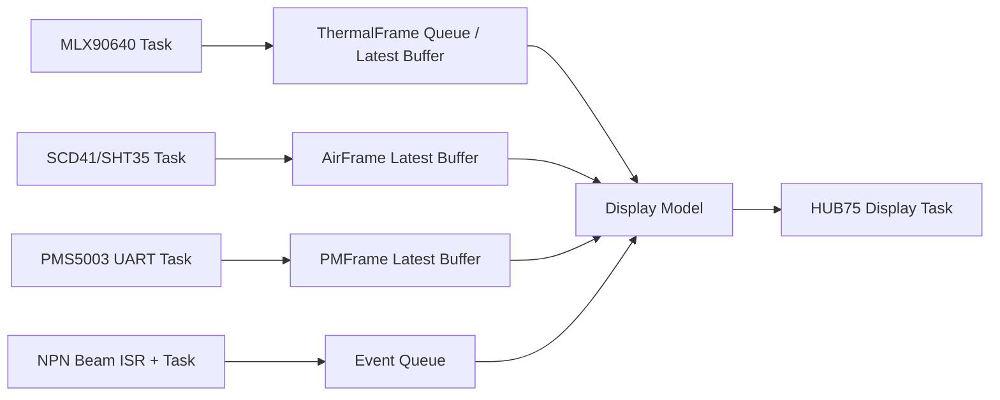

# ESP32-S3 多传感器、HUB75 点阵屏与双 NPN 对射模块驱动设计建议

> 适用对象：MLX90640 热成像阵列、PMS5003 颗粒物传感器、SCD41 CO₂ 传感器、SHT35 温湿度传感器、HUB75 RGB LED 点阵屏、两只四线制 NPN 红光对射模块。  
> 设计目标：在 ESP32-S3 上完成稳定采集、实时显示、外部触发检测，并为后续原型迭代保留调试和扩展空间。

---

## 1. 核心判断

 LED 厂商图是传统 ESP32-WROOM-32 的 HUB75 默认连接方式，不建议直接照搬到 ESP32-S3。原因很直接：ESP32-S3 的 GPIO22~GPIO25 不存在；GPIO26~GPIO32 通常与片内/片外 Flash、PSRAM 相关；GPIO0、GPIO3、GPIO45、GPIO46 是启动绑定位；GPIO19、GPIO20 默认用于 USB Serial/JTAG。若把旧 ESP32 的默认图直接迁移到 S3，轻则屏幕不亮或烧录不稳定，重则影响启动、PSRAM、USB 下载和调试。

更合理的策略是把 HUB75 这类高时序压力、线数最多的接口集中分配到一段连续 GPIO；把 I2C 传感器分成两条总线；PMS5003 使用一个硬件 UART；NPN 对射模块通过 GPIO 中断输入。这样既能降低布线复杂度，也能避免显示刷新和传感器采集互相阻塞。

总体分配如下：

- HUB75 点阵屏：GPIO4~GPIO17，连续 14 个引脚，便于排线和软件映射。
- MLX90640：独立 I2C 总线，避免高频热成像读取拖慢 CO₂ / 温湿度总线。
- SCD41 + SHT35：共享第二条 I2C 总线，采样频率较低，互不冲突。
- PMS5003：UART1，9600 bps，解析 32 字节数据帧。
- 两只 NPN 对射模块：GPIO1、GPIO2，配置为上拉输入 + 边沿中断。
- 调试口：尽量保留 GPIO19/20 的 USB，以及 GPIO43/44 的 UART0 日志。

---

## 2. 推荐 GPIO 分配表

### 2.1 总表

| 功能模块 | 模块信号 | ESP32-S3 GPIO | 方向 | 建议配置 | 说明 |
|---|---:|---:|---|---|---|
| MLX90640 | SDA | GPIO38 | 双向 | I2C0 SDA | 独立热成像总线，建议短线、强上拉 |
| MLX90640 | SCL | GPIO39 | 输出 | I2C0 SCL | 若使用外部 JTAG，可改到 GPIO47/48 或 GPIO43/44 |
| SCD41 + SHT35 | SDA | GPIO40 | 双向 | I2C1 SDA | 环境传感器总线，400 kHz 足够 |
| SCD41 + SHT35 | SCL | GPIO41 | 输出 | I2C1 SCL | 与 MLX90640 分离，降低总线占用 |
| PMS5003 | SET | GPIO42 | 输出 | 默认高电平 | 高电平/悬空正常工作，低电平休眠 |
| PMS5003 | RXD | GPIO21 | 输出 | UART1 TX | ESP32-S3 TX → PMS5003 RXD |
| PMS5003 | TXD | GPIO18 | 输入 | UART1 RX | PMS5003 TXD → ESP32-S3 RX |
| PMS5003 | RESET | GPIO47 | 输出 | 默认高电平 | 低电平复位；也可因 GPIO 紧张而不接 |
| NPN 对射 1 | OUT/NO | GPIO1 | 输入 | 上拉 + 中断 | 推荐外部 10 kΩ 上拉到 3.3 V，触发多为低电平 |
| NPN 对射 2 | OUT/NO | GPIO2 | 输入 | 上拉 + 中断 | 两路触发独立记录时间戳 |
| HUB75 | R1 | GPIO4 | 输出 | 矩阵 DMA | 高半屏红色数据 |
| HUB75 | G1 | GPIO5 | 输出 | 矩阵 DMA | 高半屏绿色数据 |
| HUB75 | B1 | GPIO6 | 输出 | 矩阵 DMA | 高半屏蓝色数据 |
| HUB75 | R2 | GPIO7 | 输出 | 矩阵 DMA | 低半屏红色数据 |
| HUB75 | G2 | GPIO8 | 输出 | 矩阵 DMA | 低半屏绿色数据 |
| HUB75 | B2 | GPIO9 | 输出 | 矩阵 DMA | 低半屏蓝色数据 |
| HUB75 | A | GPIO10 | 输出 | 行地址 | 行选择 A |
| HUB75 | B | GPIO11 | 输出 | 行地址 | 行选择 B |
| HUB75 | C | GPIO12 | 输出 | 行地址 | 行选择 C |
| HUB75 | D | GPIO13 | 输出 | 行地址 | 行选择 D |
| HUB75 | E | GPIO14 | 输出 | 行地址 | 64×64 或 1/32 扫描屏常用；不用也可保留 |
| HUB75 | LAT/STB | GPIO15 | 输出 | 锁存 | 数据锁存 |
| HUB75 | CLK | GPIO16 | 输出 | 时钟 | 点阵移位时钟 |
| HUB75 | OE | GPIO17 | 输出 | 使能/PWM | 输出使能，常用于亮度控制 |

### 2.2 保留与避让引脚

| GPIO | 建议 | 原因 |
|---:|---|---|
| GPIO0 | 避免外接强驱动 | 启动模式相关；接外设会影响下载/启动 |
| GPIO3 | 避免 | 启动绑定位之一，且无内部默认上下拉时更需谨慎 |
| GPIO19 / GPIO20 | 保留 | USB Serial/JTAG 默认使用，方便烧录和调试 |
| GPIO26~GPIO32 | 避免 | 常与 Flash/PSRAM 相关，尤其是带 PSRAM 的 S3 模组 |
| GPIO33~GPIO37 | 谨慎 | 某些 Octal Flash/PSRAM 模组中也可能被占用 |
| GPIO39~GPIO42 | 可用但谨慎 | 与 JTAG 复用；本方案用于 I2C/控制线，若需要外部 JTAG 应改线 |
| GPIO43 / GPIO44 | 优先保留 | UART0 日志口；若完全使用 USB CDC 调试，可重新分配 |
| GPIO45 / GPIO46 | 避免 | 启动绑定位，GPIO46 还与下载模式相关 |
| GPIO48 | 视开发板而定 | 很多 S3 开发板把 GPIO48 接板载 RGB LED，使用前查原理图 |

---

## 3. 各模块驱动与电气连接建议

## 3.1 MLX90640 热成像阵列

MLX90640 是 32×24 像素红外热阵列，默认 I2C 地址常见为 `0x33`。它支持较高刷新率，但在实际工程里，刷新率并不只取决于传感器本身，还取决于 I2C 速度、线长、上拉电阻、库函数计算耗时和显示刷新压力。

建议连接：

| MLX90640 | ESP32-S3 |
|---|---|
| SDA | GPIO38 |
| SCL | GPIO39 |
| VCC | 3.3 V，按模块要求接入 |
| GND | GND |

建议参数：

- 独立 I2C 总线，不与 SCD41、SHT35 共线。
- I2C 上拉电阻建议 2.2 kΩ~4.7 kΩ，线长尽量短。
- 软件目标帧率建议先设为 16 Hz 验证稳定性；若总线质量和库函数耗时允许，再提高到 32 Hz 档位，以获得接近 30 Hz 的应用刷新。
- 热成像算法建议不要在显示刷新回调中执行，应由独立任务读取和计算，再把温度矩阵或简化后的热力图送入显示缓冲区。
- 若使用 ESP-IDF 官方 I2C 驱动，优先按 400 kHz 设计；若为追求 30 Hz 尝试 800 kHz 或更高速度，需要用逻辑分析仪确认 SCL/SDA 波形、ACK、重复启动和错误率。

数据处理建议：

- 原始帧：`int16_t raw[834]` 或按库要求保留 RAM/EEPROM 数据。
- 温度帧：`float temp[768]`，一帧约 3 KB。
- 显示帧：将 32×24 温度阵列映射到 LED 点阵，例如 64×32 屏可做 2 倍横向放大、纵向居中；也可以显示最高温、平均温、异常区域框。
- 采集队列只保留最新帧，避免显示任务处理慢时堆积大量热图。

---

## 3.2 PMS5003 颗粒物传感器

PMS5003 供电通常为 5 V，但数据接口是 3.3 V TTL 电平，适合直接接 ESP32-S3 的 UART。它上电后默认主动输出数据，常用通信格式为 9600 bps、8N1、32 字节帧，帧头为 `0x42 0x4D`。

建议连接：

| PMS5003 | ESP32-S3 | 说明 |
|---|---:|---|
| SET | GPIO42 | 高电平或悬空正常工作，低电平休眠 |
| RXD | GPIO21 / UART1 TX | ESP32-S3 向 PMS5003 发送命令 |
| TXD | GPIO18 / UART1 RX | PMS5003 向 ESP32-S3 输出数据 |
| RESET | GPIO47 | 低电平复位 |
| VCC | 5 V | 风扇需要 5 V，不建议从弱 3.3 V 供电 |
| GND | GND | 与 ESP32-S3 共地 |

驱动建议：

- UART 初始化为 `9600, 8N1`。
- 默认使用主动模式，任务循环从 UART 环形缓冲区中查找帧头 `0x42 0x4D`。
- 每帧校验：累加前 30 字节，与最后 2 字节校验和比较。
- SET 从低电平休眠恢复后，前 30 秒数据建议丢弃，等待风扇和气流稳定。
- RESET 引脚若资源紧张可以不接，因为模块内部通常对 SET/RESET 有上拉；但比赛原型和调试阶段建议保留 RESET，便于故障恢复。

---

## 3.3 SCD41 CO₂ 传感器

SCD41 推荐与 SHT35 共用环境传感器 I2C 总线。SCD41 的典型 I2C 地址为 `0x62`，周期测量模式下信号更新间隔为 5 秒，因此不会对总线造成明显压力。

建议连接：

| SCD41 | ESP32-S3 |
|---|---|
| SDA | GPIO40 |
| SCL | GPIO41 |
| VCC | 3.3 V 或按模块要求 |
| GND | GND |

驱动建议：

- 初始化后发送 `start_periodic_measurement`。
- 每 5 秒读取一次 `read_measurement`，获得 CO₂、温度、湿度。
- 如果已经使用 SHT35 作为主要温湿度来源，SCD41 的温湿度可以作为 CO₂ 补偿和交叉验证，不一定直接显示。
- 若设备外壳存在热源，SCD41 温度可能受自热和主板热影响；必要时设置温度偏移，或采用 SHT35 外置位置的温度作为环境温度参考。

---

## 3.4 SHT35 温湿度传感器

SHT35 与 SCD41 共用 I2C1。SHT35 默认地址通常是 `0x44`，ADDR 拉高时为 `0x45`。在本系统中它可以作为更可靠的环境温湿度来源，用于显示和算法补偿。

建议连接：

| SHT35 | ESP32-S3 |
|---|---|
| SDA | GPIO40 |
| SCL | GPIO41 |
| VCC | 3.3 V 或按模块要求 |
| GND | GND |

驱动建议：

- 采样周期设为 1 s 或 2 s，没必要高频读取。
- 单次测量模式优先，降低自热与总线占用。
- 读取数据后校验 CRC。
- SHT35 尽量远离 LED 屏、电源模块、ESP32-S3 和 PMS5003 风道，避免测到局部热源而不是环境空气。

---

## 3.5 HUB75 RGB LED 点阵屏

HUB75 点阵屏占用 GPIO 多、刷新频率高，是整个系统中对时序和电源最敏感的部分。建议把它作为独立显示子系统处理，不要用普通 `digitalWrite()` 手动刷屏，而应使用 DMA/I2S/LCD 并行刷新的成熟库。

推荐连接：

| HUB75 | ESP32-S3 GPIO | 说明 |
|---|---:|---|
| R1 | GPIO4 | 高半屏红 |
| G1 | GPIO5 | 高半屏绿 |
| B1 | GPIO6 | 高半屏蓝 |
| R2 | GPIO7 | 低半屏红 |
| G2 | GPIO8 | 低半屏绿 |
| B2 | GPIO9 | 低半屏蓝 |
| A | GPIO10 | 行地址 A |
| B | GPIO11 | 行地址 B |
| C | GPIO12 | 行地址 C |
| D | GPIO13 | 行地址 D |
| E | GPIO14 | 1/32 扫描或 64×64 屏可能需要 |
| LAT/STB | GPIO15 | 锁存 |
| CLK | GPIO16 | 时钟 |
| OE | GPIO17 | 输出使能/亮度 |
| GND | GND | 必须与 ESP32-S3 共地 |
| 5V | 外部 5 V 大电流电源 | 不要用开发板 5V 小电流口直接带大屏 |

硬件建议：

- HUB75 屏建议使用独立 5 V 电源，电流按屏幕尺寸和亮度预留余量。64×32 单屏通常也可能达到数安培量级，具体取决于亮度、扫描方式和显示内容。
- 在屏幕 5 V 输入处并联 470 µF~1000 µF 电解电容，并加 0.1 µF 陶瓷电容。
- ESP32-S3 到 HUB75 的 13 条逻辑线推荐经过 74AHCT245 / 74HCT245 做 3.3 V 到 5 V 电平转换。短线、低亮度、单屏时 3.3 V 直连可能能亮，但抗干扰和比赛现场稳定性不如电平转换方案。
- OE、CLK、LAT 线对毛刺较敏感，走线应短且避免贴近电源开关节点。
- 若屏幕是 64×32、1/16 扫描，E 线可能无效；若屏幕是 64×64 或 1/32 扫描，E 线必须接。

软件建议：

- Arduino/PlatformIO 快速原型可使用 `ESP32-HUB75-MatrixPanel-DMA`。
- ESP-IDF 工程可考虑使用 LCD/I2S 并行 DMA 方案，或封装已有 HUB75 驱动为组件。
- 刷新任务只负责显示已有缓冲区，不直接读取传感器。
- 色深先设为 4~6 bit/通道，等系统稳定后再提高。色深越高，DMA 内存和刷新压力越大。

---

## 3.6 两只 NPN 四线制红光对射模块

你给出的模块是 6~36 V 供电的 NPN 输出对射型传感器。常见四线制颜色定义如下：

| 线色 | 常见含义 | 连接建议 |
|---|---|---|
| 棕色 | 电源正极 | 接传感器工作电压，例如 12 V 或 24 V，按模块铭牌确认 |
| 蓝色 | 电源负极 | 接传感器电源 GND |
| 黑色 | NPN 常开 NO 输出 | 推荐作为主触发信号 |
| 白色 | NPN 常闭 NC 输出或模式线 | 视实际型号说明选择；不确定时先悬空并用万用表确认 |

NPN 输出本质上通常是“下拉型输出”：触发时输出晶体管导通，把信号线拉向 GND；未触发时输出悬空，需要外部上拉电阻。由于该传感器可能工作在 12 V 或 24 V，不能把输出线当作普通 3.3 V 推挽信号直接接入 ESP32-S3。建议优先使用光耦隔离。

### 推荐接法 A：光耦隔离，适合比赛原型和较长线缆

传感器侧：

- 棕色接 +12 V / +24 V。
- 蓝色接传感器电源 GND。
- 黑色 NO 输出接光耦输入 LED 阴极。
- 光耦输入 LED 阳极通过限流电阻接传感器电源正极。
- 限流电阻按供电选择：12 V 可从 2.2 kΩ 起步，24 V 可从 4.7 kΩ 起步，最终以光耦 CTR 和抗干扰测试调整。

ESP32-S3 侧：

- 光耦输出晶体管发射极接 ESP32-S3 GND。
- 光耦输出晶体管集电极接 GPIO1 或 GPIO2，同时用 10 kΩ 上拉到 3.3 V。
- GPIO 配置为输入，上拉，触发逻辑通常为低有效或高有效，取决于光耦接法。

### 可选接法 B：共地直接上拉，仅适合确认输出为开集电极的场景

- 传感器蓝色 GND 与 ESP32-S3 GND 共地。
- 黑色 NO 输出接 GPIO1/GPIO2。
- GPIO 外接 10 kΩ 上拉到 3.3 V，并串联 1 kΩ 保护电阻。
- 软件配置内部上拉，但外部上拉仍建议保留。
- 用万用表确认黑线在任何状态下都不会输出高于 3.3 V 的电压；若不确定，不要使用此接法。

对射模块驱动逻辑：

- 使用 GPIO 中断记录边沿，不在 ISR 里做复杂运算。
- 中断中只记录 `gpio_num`、`level`、`timestamp_us`，再投递到队列。
- 主任务中做去抖与状态机判断。光电传感器虽然不是机械开关，但长线缆、强光、电源干扰会造成窄脉冲，建议设置 1~5 ms 的最小有效脉宽。
- 若两只对射模块用于判断物体进入/离开或速度估算，应记录两路触发的时间差，并在配置中写明两个光轴的实际距离。

---

## 4. ESP32-S3 硬件资源分配

| 资源 | 分配对象 | 说明 |
|---|---|---|
| I2C0 | MLX90640 | 热成像高占用总线，独立运行 |
| I2C1 | SCD41 + SHT35 | 低速环境数据总线 |
| UART1 | PMS5003 | 9600 bps，32 字节帧解析 |
| GPIO 中断 | 两只 NPN 对射模块 | 触发、计时、速度/通过判断 |
| DMA / I2S / LCD 并行资源 | HUB75 点阵屏 | 高刷新显示，减少 CPU 阻塞 |
| FreeRTOS 队列 | 传感器数据交换 | 避免各任务直接互相调用 |
| 软件定时器 | 周期采样与超时检测 | SCD41、SHT35、PMS、UI 刷新 |
| PSRAM | 非实时缓存、日志、历史帧 | DMA 关键缓冲是否可放 PSRAM 取决于库实现 |
| 内部 SRAM | DMA 缓冲、队列、实时帧 | 优先给 HUB75 和实时任务使用 |

建议选用带 PSRAM 的 ESP32-S3 模组，例如 N8R8 或 N16R8。即使某些 DMA 缓冲仍需放在内部 SRAM，PSRAM 也能承载历史数据、UI 资源、网络缓冲和非实时日志，从而给显示驱动留出内部内存。

---

## 5. 软件架构建议

### 5.1 推荐工程框架

若你的主要目标是快速做出可演示原型，建议使用：

- PlatformIO + Arduino-ESP32
- ESP32-HUB75-MatrixPanel-DMA
- Sensirion SCD4x / SHT3x 库
- Melexis MLX90640 官方或移植库
- 自写 PMS5003 帧解析器和 NPN 输入状态机

若后续需要更强的可靠性、OTA、日志、任务监控和工程化配置，可以迁移到 ESP-IDF。迁移时不要把业务逻辑写死在 Arduino 的 `loop()` 中，应在原型阶段就采用“驱动层 + 服务层 + 应用层”的组织方式。

### 5.2 推荐目录结构

```text
firmware/
  platformio.ini
  include/
    pin_map.h              # 全部 GPIO、总线、采样周期集中定义
    app_config.h           # 屏幕尺寸、帧率、阈值、校准参数
    data_types.h           # SensorFrame、ThermalFrame、AirQualityFrame 等结构体
  src/
    main.cpp
    app_tasks.cpp
    app_tasks.h
    drivers/
      i2c_bus.cpp
      i2c_bus.h
      mlx90640_driver.cpp
      mlx90640_driver.h
      scd41_driver.cpp
      scd41_driver.h
      sht35_driver.cpp
      sht35_driver.h
      pms5003_driver.cpp
      pms5003_driver.h
      hub75_display.cpp
      hub75_display.h
      beam_sensor.cpp
      beam_sensor.h
    services/
      sensor_manager.cpp
      sensor_manager.h
      display_model.cpp
      display_model.h
      event_logic.cpp
      event_logic.h
      fault_monitor.cpp
      fault_monitor.h
    utils/
      crc8.cpp
      ring_buffer.cpp
      moving_average.cpp
  test/
    test_pms5003_parser.cpp
    test_beam_state_machine.cpp
  docs/
    wiring.md
    calibration.md
```

### 5.3 `pin_map.h` 示例

```cpp
#pragma once

// I2C0: MLX90640
constexpr int PIN_MLX_SDA = 38;
constexpr int PIN_MLX_SCL = 39;

// I2C1: SCD41 + SHT35
constexpr int PIN_ENV_SDA = 40;
constexpr int PIN_ENV_SCL = 41;

// PMS5003 UART1
constexpr int PIN_PMS_RX_FROM_SENSOR = 18;  // ESP32-S3 RX, connect to PMS5003 TXD
constexpr int PIN_PMS_TX_TO_SENSOR   = 21;  // ESP32-S3 TX, connect to PMS5003 RXD
constexpr int PIN_PMS_SET            = 42;
constexpr int PIN_PMS_RESET          = 47;

// NPN beam sensors
constexpr int PIN_BEAM_1 = 1;
constexpr int PIN_BEAM_2 = 2;

// HUB75 RGB matrix
constexpr int PIN_HUB75_R1  = 4;
constexpr int PIN_HUB75_G1  = 5;
constexpr int PIN_HUB75_B1  = 6;
constexpr int PIN_HUB75_R2  = 7;
constexpr int PIN_HUB75_G2  = 8;
constexpr int PIN_HUB75_B2  = 9;
constexpr int PIN_HUB75_A   = 10;
constexpr int PIN_HUB75_B   = 11;
constexpr int PIN_HUB75_C   = 12;
constexpr int PIN_HUB75_D   = 13;
constexpr int PIN_HUB75_E   = 14;
constexpr int PIN_HUB75_LAT = 15;
constexpr int PIN_HUB75_CLK = 16;
constexpr int PIN_HUB75_OE  = 17;

// I2C addresses
constexpr uint8_t ADDR_MLX90640 = 0x33;
constexpr uint8_t ADDR_SCD41    = 0x62;
constexpr uint8_t ADDR_SHT35_A  = 0x44;
constexpr uint8_t ADDR_SHT35_B  = 0x45;
```

---

## 6. FreeRTOS 任务划分

| 任务 | 建议周期 | 优先级 | 核心建议 | 主要职责 |
|---|---:|---:|---|---|
| `TaskDisplay` | 20~60 FPS | 高 | Core 1 | 刷新 HUB75、渲染 UI、显示最新数据 |
| `TaskThermal` | 16~32 Hz | 中高 | Core 0 | 读取 MLX90640、计算温度矩阵、生成热图 |
| `TaskAirQuality` | 1 s | 中 | Core 0 | 管理 SCD41、SHT35，更新环境数据 |
| `TaskPMS5003` | UART 事件驱动 | 中 | Core 0 | 解析颗粒物数据帧、校验和、异常恢复 |
| `TaskBeamEvent` | 中断驱动 | 中高 | Core 0 | 处理两路对射触发、去抖、事件判定 |
| `TaskFaultMonitor` | 1~5 s | 低 | 任意 | 看门狗喂狗、传感器超时、状态上报 |

任务之间不要直接共享裸变量，建议使用队列或双缓冲。显示任务只读取“最新快照”，传感器任务只负责生产数据。这样即使某个传感器短暂超时，也不会卡住 LED 屏刷新。

推荐数据流：



---

## 7. 初始化顺序建议

系统启动时按以下顺序更稳：

1. 初始化日志、GPIO 安全电平和看门狗。
2. 将 PMS5003 的 SET、RESET 拉到默认安全状态：SET 高，RESET 高。
3. 初始化两条 I2C 总线并执行 I2C 扫描，确认 `0x33`、`0x62`、`0x44/0x45` 是否存在。
4. 初始化 SHT35，读取一次温湿度。
5. 初始化 SCD41，发送周期测量命令。
6. 初始化 MLX90640，加载 EEPROM/校准参数，设置刷新率。
7. 初始化 PMS5003 UART，清空串口缓冲区。
8. 初始化 NPN 输入 GPIO 和中断。
9. 初始化 HUB75 显示，先显示自检画面：红、绿、蓝、白、黑、行列测试。
10. 启动各采集任务和显示任务。

---

## 8. 关键软件实现要点

### 8.1 PMS5003 解析器

PMS5003 不建议用“固定读 32 字节”的方式处理，因为串口可能从任意位置开始接收。更可靠的做法是维护一个字节流状态机：

```text
WAIT_HEADER_1 -> WAIT_HEADER_2 -> READ_FRAME -> VERIFY_CHECKSUM -> PUBLISH
```

解析成功后发布：PM1.0、PM2.5、PM10、不同粒径颗粒数、时间戳。连续校验失败时清空缓冲并重新找帧头。

### 8.2 MLX90640 热图处理

MLX90640 的温度计算相对耗时，不应在 UI 绘制函数里做完整浮点计算。建议分三层：

- 驱动层读取 raw data。
- 算法层转换为 32×24 温度矩阵，并计算 `min / max / avg / hotspot`。
- 显示层只拿已经转换好的色彩索引图或简化结果。

如果 LED 屏只用于环境状态提示，不必每帧都显示完整热图。可以采用“热图低频 + 数值高频”的 UI 策略，例如热图 10~15 Hz，数值状态 2 Hz。

### 8.3 NPN 对射事件状态机

两只对射模块可以形成“进入/通过/离开/异常遮挡”的状态机：

```text
IDLE
  -> BEAM1_BLOCKED
  -> BEAM1_THEN_BEAM2
  -> PASSED
  -> IDLE
```

如果 BEAM1 和 BEAM2 的距离已知，还可以估算通过速度：

```text
speed = distance_between_beams_m / delta_time_s
```

异常条件需要单独处理：

- 单路持续遮挡超过阈值：可能物体停留或传感器安装偏移。
- 两路同时长时间遮挡：可能大物体、安装过近或光轴被遮挡。
- 窄脉冲频繁出现：可能电源干扰或线缆拾噪。

### 8.4 HUB75 显示刷新

显示任务应只处理渲染和缓冲区交换。建议 UI 分区：

- 顶部：CO₂、温湿度、PM2.5。
- 中部：热图或热异常区域。
- 底部：对射状态、报警状态、设备在线状态。

如果屏幕较小，优先显示状态与异常，不要堆叠太多小字。LED 点阵在现场展示时，远距离可读性比信息密度更重要。

---

## 9. 电源与抗干扰设计

系统中最容易制造干扰的是 HUB75 点阵屏和 PMS5003 风扇。传感器数据不稳定时，往往不是代码问题，而是电源和地线设计问题。

建议电源结构：

```text
外部 5V 大电流电源 ── HUB75 点阵屏
                   ├── ESP32-S3 开发板 5V 输入
                   └── PMS5003 5V

ESP32-S3 3.3V ── MLX90640 / SCD41 / SHT35 / 上拉电阻
```

关键建议：

- HUB75 屏单独走较粗电源线，不要让大电流穿过面包板或细杜邦线。
- 所有模块必须共地；若 NPN 对射模块用光耦隔离，传感器侧和 MCU 侧可按隔离方案处理。
- I2C 线加 2.2 kΩ~10 kΩ 上拉，取值根据总线速度和线长调整。多个模块板载上拉并联时，等效阻值可能过小，需要检查。
- PMS5003 电源旁加 100 µF 以上电容，减少风扇启动造成的电压跌落。
- HUB75 排线和 I2C 线不要并行长距离贴近；必要时 I2C 使用双绞线或屏蔽线。
- 对射模块线缆较长时，GPIO 输入侧增加 RC 滤波、TVS 或光耦隔离。

---

## 10. 推荐开发步骤

为避免一次性接入所有模块后难以排错，建议按以下顺序推进：

### 阶段 A：GPIO 与总线自检

- 只接 ESP32-S3，确认 USB 下载、串口日志正常。
- 运行 GPIO 输出测试，确认 HUB75 分配的 GPIO4~GPIO17 没有被开发板外设占用。
- 运行 I2C scanner，分别确认 MLX90640、SCD41、SHT35 地址。

### 阶段 B：单模块驱动

- PMS5003 单独接入，确认可以解析有效帧和校验和。
- SCD41 + SHT35 接入，确认周期读取稳定。
- MLX90640 接入，先以低帧率读取，确认没有 I2C NACK 和温度异常。
- NPN 对射模块接入，用串口打印边沿时间戳。

### 阶段 C：显示系统

- HUB75 显示红、绿、蓝、白、黑测试图。
- 测试 ABCDE 行地址是否正确，若出现上下错行、隔行异常，优先检查屏幕扫描方式和 E 线。
- 加入数值显示，不接热图，确认刷新稳定。

### 阶段 D：系统联调

- 同时运行 PMS5003、SCD41、SHT35、HUB75，观察 30 分钟。
- 加入 MLX90640，逐步提高刷新率。
- 加入 NPN 对射触发，验证事件不会造成显示卡顿。
- 最后进行满亮度显示、电源跌落、长时间运行、插拔复位测试。

---

## 11. 风险与替代方案

| 风险 | 表现 | 处理建议 |
|---|---|---|
| MLX90640 30 Hz 不稳定 | I2C NACK、热图卡顿、帧率不足 | 降到 16 Hz；缩短线缆；加强上拉；分离总线；优化浮点计算 |
| HUB75 闪烁 | 屏幕亮度变化、花屏、错行 | 使用 DMA 驱动；降低色深；缩短排线；加 74AHCT245；加强 5 V 供电 |
| ESP32-S3 无法启动 | 烧录失败、上电进下载模式 | 检查 GPIO0/3/45/46 是否被外设拉错电平 |
| PMS5003 数据不可信 | 刚唤醒读数漂移 | 唤醒后丢弃至少 30 秒数据；保持风道通畅 |
| NPN 输入误触发 | 无物体时也触发 | 光耦隔离、RC 滤波、软件最小脉宽、屏蔽线 |
| 温湿度偏高 | SHT35/SCD41 受主板或 LED 热影响 | 传感器外置，远离热源和风扇回流 |
| 内存不足 | 编译通过但运行重启 | 降低 HUB75 色深和链屏数量；启用 PSRAM；减少历史帧缓存 |

---

## 12. 最终接线摘要

如果只看接线，按下表执行即可：

```text
MLX90640:
  SDA -> GPIO38
  SCL -> GPIO39

SCD41 + SHT35:
  SDA -> GPIO40
  SCL -> GPIO41

PMS5003:
  SET   -> GPIO42
  RXD   -> GPIO21  (ESP TX)
  TXD   -> GPIO18  (ESP RX)
  RESET -> GPIO47

NPN 对射模块:
  Sensor 1 OUT/NO -> GPIO1
  Sensor 2 OUT/NO -> GPIO2
  棕色 -> 传感器电源正极
  蓝色 -> 传感器电源负极
  黑色 -> 推荐作为 NO 输出
  白色 -> 视实际型号作为 NC 输出或模式线，先用万用表确认

HUB75:
  R1  -> GPIO4
  G1  -> GPIO5
  B1  -> GPIO6
  R2  -> GPIO7
  G2  -> GPIO8
  B2  -> GPIO9
  A   -> GPIO10
  B   -> GPIO11
  C   -> GPIO12
  D   -> GPIO13
  E   -> GPIO14
  LAT -> GPIO15
  CLK -> GPIO16
  OE  -> GPIO17
```

---

## 13. 版本建议

当前方案更偏向“比赛原型可稳定演示”的设计，而不是极限压榨 GPIO 或极限帧率。实际 PCB 设计前，建议你补充三项信息再冻结引脚：

- ESP32-S3 开发板或模组的准确型号，例如 ESP32-S3-DevKitC-1-N8R8、N16R8、某宝 S3-WROOM 板等。
- HUB75 屏的尺寸与扫描方式，例如 64×32 1/16 扫、64×64 1/32 扫。
- 对射模块实际供电电压，以及黑/白两线在 NO/NC 或模式线上的真实定义。

如果后续要做 PCB，建议把 GPIO39~GPIO42 这组 JTAG 复用线通过 0 Ω 电阻或焊盘跳线引出，便于调试和改线；HUB75 的 13 条线则尽量保持连续、等长和短走线。
