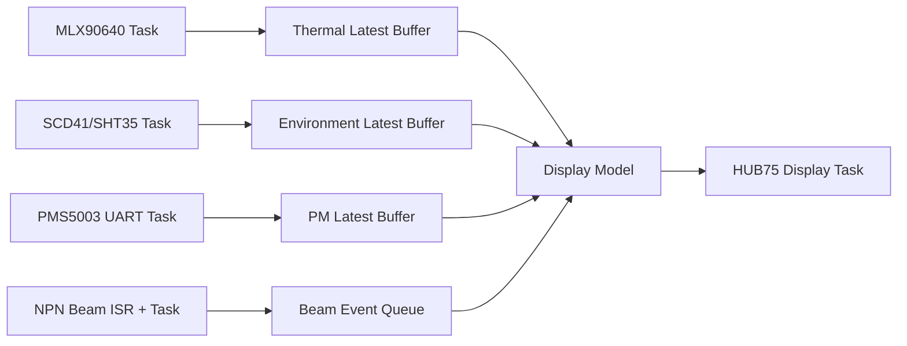

# ESP32-S3 实际最小系统板多模块驱动与引脚分配设计建议 V2

> 适用硬件：你当前采购的 ESP32-S3-WROOM-1 最小系统板，排针图中左侧依次暴露 GPIO4/5/6/7/15/16/17/18/8/3/46/9/10/11/12/13/14，右侧依次暴露 GPIO43/44/1/2/42/41/40/39/38/37/36/35/0/45/48/47/21/20/19。  
> 适用模块：MLX90640 热成像阵列、PMS5003 颗粒物传感器、SCD41 CO₂ 传感器、SHT35 温湿度传感器、HUB75 RGB LED 点阵屏、两只四线制 NPN 红光对射模块。  
> 设计目标：在不破坏 ESP32-S3 启动、USB 下载、串口日志和板载外设的前提下，实现稳定采集、实时显示、外部触发检测，并为后续 PCB 化和比赛原型演示留出调试余量。

---

## 1. V2 版本修改结论

上一版方案按 ESP32-S3 的通用 GPIO 资源做了分配，但你新提供的最小系统板排针图显示，这块板的物理排针顺序并不是简单的 GPIO4 到 GPIO17 连续排列；同时 GPIO38 标注为板载 RGB_LED，GPIO19/GPIO20 用作 USB_D-/USB_D+，GPIO43/GPIO44 是默认 UART0，GPIO39~GPIO42 与 JTAG 功能复用。基于这张实际排针图，V2 版本对引脚做了重新整理。

这版方案的核心思路如下：

- HUB75 点阵屏优先占用左侧排针，尽量让 14 条线在物理焊接上集中，避开 GPIO3 和 GPIO46 这两个启动相关引脚。
- MLX90640 使用独立 I2C，总线放到右侧 GPIO39/GPIO40，避免它较高帧率读取拖慢低速环境传感器。
- SCD41 与 SHT35 共用第二条 I2C，总线放到右侧 GPIO41/GPIO42，采样频率低、通信负载小，适合共享。
- PMS5003 使用 UART GPIO Matrix 映射，不强依赖图上默认串口脚；SET 和 RESET 单独保留 GPIO 控制。
- 两只 NPN 对射模块继续使用 GPIO1/GPIO2，适合做输入中断，并且在右侧排针上相邻，接线清晰。
- GPIO19/GPIO20、GPIO43/GPIO44、GPIO0/GPIO3/GPIO45/GPIO46、GPIO38 不作为关键功能线使用，降低下载、调试和启动异常风险。

---

## 2. 实际开发板排针可用性判断

### 2.1 建议保留或避开的引脚

| GPIO | 图中标识 / 复用关系 | V2 建议 | 原因 |
|---:|---|---|---|
| GPIO0 | BOOT | 避免作为外设信号 | 启动/下载模式相关，外部电平异常会导致无法正常启动 |
| GPIO1 | RTC / TOUCH / ADC | 可用 | 适合低速输入，本方案用于 NPN 对射 1 |
| GPIO2 | RTC / TOUCH / ADC | 可用 | 适合低速输入，本方案用于 NPN 对射 2 |
| GPIO3 | JTAG / RTC / TOUCH | 避免 | 启动绑定位之一，不建议接 HUB75 或传感器中断 |
| GPIO4~GPIO18 | 左侧主要 GPIO | 可用 | 适合集中分配给 HUB75，但需要跳过 GPIO3、GPIO46 |
| GPIO19 / GPIO20 | USB_D- / USB_D+ | 保留 | 用于 USB 下载、USB CDC、USB/JTAG 调试，尽量不要占用 |
| GPIO21 | 普通 GPIO | 可用 | 本方案用于 PMS5003 UART RX |
| GPIO35~GPIO37 | SPI/PSRAM 相关标识 | 暂不占用 | 不同 S3 模组对这些脚的内部连接可能不同，先留作扩展或验证后使用 |
| GPIO38 | RGB_LED | 避免关键功能 | 很多开发板把它接到板载 RGB LED，外设使用可能受板载电路影响 |
| GPIO39~GPIO42 | MTCK/MTDO/MTDI/MTMS，JTAG 复用 | 可用但不接外部 JTAG | 本方案用于两组 I2C；若你后续必须使用外部 JTAG，需要重新改线 |
| GPIO43 / GPIO44 | U0TXD / U0RXD | 优先保留 | 默认串口日志口，后续排错方便 |
| GPIO45 | VSPI / 启动相关 | 避免 | 启动绑定位，不建议挂接会影响上电电平的外设 |
| GPIO46 | LOG / 启动相关 | 避免 | 启动绑定位，不建议用于 HUB75 刷新线 |
| GPIO47 / GPIO48 | 普通 GPIO | 可用 | 本方案用于 PMS5003 TX 与 RESET；注意确认 GPIO48 是否另接板载灯 |

### 2.2 与上一版相比的主要变化

| 模块 | 上一版思路 | V2 修正 |
|---|---|---|
| HUB75 | GPIO4~GPIO17 按逻辑连续分配 | 改为按开发板左侧排针顺序分配，跳过 GPIO3/GPIO46，实际使用 GPIO4/5/6/7/15/16/17/18/8/9/10/11/12/13 |
| MLX90640 | GPIO38/GPIO39 | 改为 GPIO39/GPIO40，避开图中标注为 RGB_LED 的 GPIO38 |
| SCD41 + SHT35 | GPIO40/GPIO41 | 改为 GPIO41/GPIO42，仍保持右侧相邻 |
| PMS5003 | SET GPIO42，RX GPIO18，TX GPIO21，RESET GPIO47 | 改为 SET GPIO14，RX GPIO21，TX GPIO47，RESET GPIO48，避免占用 I2C 与 HUB75 关键脚 |
| NPN 对射 | GPIO1/GPIO2 | 保持不变 |

---

## 3. V2 推荐 GPIO 分配总表

| 功能模块 | 模块信号 | ESP32-S3 GPIO | 方向 | 建议配置 | 说明 |
|---|---|---:|---|---|---|
| MLX90640 | SDA | GPIO39 | 双向 | I2C0 SDA | 独立热成像总线，右侧相邻排针 |
| MLX90640 | SCL | GPIO40 | 输出 | I2C0 SCL | 与 JTAG 复用，不使用外部 JTAG 时可用 |
| SCD41 + SHT35 | SDA | GPIO41 | 双向 | I2C1 SDA | 环境传感器总线 |
| SCD41 + SHT35 | SCL | GPIO42 | 输出 | I2C1 SCL | 400 kHz 足够 |
| PMS5003 | SET | GPIO14 | 输出 | 默认高电平 | 高电平/悬空正常工作，低电平休眠 |
| PMS5003 | TXD | GPIO21 | 输入 | UART1 RX | PMS5003 TXD → ESP32-S3 RX |
| PMS5003 | RXD | GPIO47 | 输出 | UART1 TX | ESP32-S3 TX → PMS5003 RXD |
| PMS5003 | RESET | GPIO48 | 输出 | 默认高电平 | 低电平复位，建议保留 |
| NPN 对射 1 | OUT / NO | GPIO1 | 输入 | 上拉 + 中断 | 建议光耦隔离或确认开集电极后 3.3 V 上拉 |
| NPN 对射 2 | OUT / NO | GPIO2 | 输入 | 上拉 + 中断 | 两路触发独立记录时间戳 |
| HUB75 | R1 | GPIO4 | 输出 | HUB75 DMA | 高半屏红色数据 |
| HUB75 | G1 | GPIO5 | 输出 | HUB75 DMA | 高半屏绿色数据 |
| HUB75 | B1 | GPIO6 | 输出 | HUB75 DMA | 高半屏蓝色数据 |
| HUB75 | R2 | GPIO7 | 输出 | HUB75 DMA | 低半屏红色数据 |
| HUB75 | G2 | GPIO15 | 输出 | HUB75 DMA | 左侧排针上方连续段；不使用 32 kHz 外部晶振时可用 |
| HUB75 | B2 | GPIO16 | 输出 | HUB75 DMA | 同上 |
| HUB75 | A | GPIO17 | 输出 | 行地址 | 行选择 A |
| HUB75 | B | GPIO18 | 输出 | 行地址 | 行选择 B |
| HUB75 | C | GPIO8 | 输出 | 行地址 | 左侧排针中段 |
| HUB75 | D | GPIO9 | 输出 | 行地址 | 已跳过 GPIO3/GPIO46 |
| HUB75 | E | GPIO10 | 输出 | 行地址 | 64×64 或 1/32 扫描屏常用 |
| HUB75 | LAT / STB | GPIO11 | 输出 | 锁存 | 数据锁存 |
| HUB75 | CLK | GPIO12 | 输出 | 时钟 | 点阵移位时钟 |
| HUB75 | OE | GPIO13 | 输出 | 使能 / PWM | 输出使能，常用于亮度控制 |

---

## 4. 实际焊接接线摘要

如果你只想按表焊接，优先使用下面这张简表。

```text
MLX90640:
  SDA -> GPIO39
  SCL -> GPIO40

SCD41 + SHT35:
  SDA -> GPIO41
  SCL -> GPIO42

PMS5003:
  SET   -> GPIO14
  TXD   -> GPIO21  (PMS5003 TXD 接 ESP32-S3 RX)
  RXD   -> GPIO47  (PMS5003 RXD 接 ESP32-S3 TX)
  RESET -> GPIO48

NPN 对射模块:
  Sensor 1 OUT / NO -> GPIO1
  Sensor 2 OUT / NO -> GPIO2
  棕色 -> 传感器电源正极，例如 12 V 或 24 V，按模块铭牌确认
  蓝色 -> 传感器电源负极
  黑色 -> 常见为 NPN NO 输出，建议作为触发信号
  白色 -> 常见为 NC 输出或模式线，不确定时先悬空并用万用表确认

HUB75:
  R1  -> GPIO4
  G1  -> GPIO5
  B1  -> GPIO6
  R2  -> GPIO7
  G2  -> GPIO15
  B2  -> GPIO16
  A   -> GPIO17
  B   -> GPIO18
  C   -> GPIO8
  D   -> GPIO9
  E   -> GPIO10
  LAT -> GPIO11
  CLK -> GPIO12
  OE  -> GPIO13
```

---

## 5. HUB75 点阵屏设计建议

HUB75 是整个系统里 GPIO 占用最多、刷新压力最大、对电源最敏感的模块。V2 分配把 HUB75 尽量集中在左侧排针，是为了减少跨板飞线和焊接混乱，但这不是普通“低速 IO 扩展”，不建议用 `digitalWrite()` 人工刷屏。更稳妥的方案是使用 DMA/I2S/LCD 并行刷新类库。

### 5.1 推荐连接表

| HUB75 信号 | ESP32-S3 GPIO | 备注 |
|---|---:|---|
| R1 | GPIO4 | 高半屏红 |
| G1 | GPIO5 | 高半屏绿 |
| B1 | GPIO6 | 高半屏蓝 |
| R2 | GPIO7 | 低半屏红 |
| G2 | GPIO15 | 低半屏绿 |
| B2 | GPIO16 | 低半屏蓝 |
| A | GPIO17 | 行地址 A |
| B | GPIO18 | 行地址 B |
| C | GPIO8 | 行地址 C |
| D | GPIO9 | 行地址 D |
| E | GPIO10 | 行地址 E，64×64 或 1/32 扫描屏常用 |
| LAT / STB | GPIO11 | 锁存 |
| CLK | GPIO12 | 时钟 |
| OE | GPIO13 | 输出使能 / 亮度控制 |

### 5.2 硬件注意点

- HUB75 屏使用独立 5 V 大电流电源，不要依赖 ESP32-S3 板载 USB 口直接给大屏供电。
- 屏幕电源输入处建议并联 470 µF~1000 µF 电解电容，同时靠近接口放置 0.1 µF 陶瓷电容。
- ESP32-S3 的 3.3 V GPIO 直接接 HUB75 在短线、单屏、低亮度时可能能工作，但比赛现场为了稳定，建议加 74AHCT245 或 74HCT245 做 3.3 V 到 5 V 逻辑电平转换。
- CLK、LAT、OE 三根线比普通颜色数据线更敏感，尽量短、直、远离开关电源和大电流路径。
- 如果屏幕是 64×32、1/16 扫描，E 线可能不需要；如果屏幕是 64×64、1/32 扫描，E 线必须接。

### 5.3 软件建议

- Arduino / PlatformIO 原型阶段可使用 `ESP32-HUB75-MatrixPanel-DMA`。
- ESP-IDF 工程阶段可将显示驱动封装为独立组件，底层使用 DMA 刷新，上层只提交显示缓冲。
- 色深从 4~6 bit/通道起步，系统稳定后再提高。色深越高，DMA 内存、刷新时序和电源压力越大。
- 显示任务只读取已经整理好的显示模型，不要在刷新回调里读取传感器或做热成像浮点计算。

---

## 6. MLX90640 热成像阵列

MLX90640 是 32×24 像素红外热阵列，你预计 30 Hz 应用刷新率。实际系统中，30 Hz 不只取决于传感器支持能力，还受到 I2C 速度、线长、上拉、电磁干扰、库函数计算耗时和显示刷新占用的影响。V2 将它单独放在 I2C0 上，是为了减少和 SCD41/SHT35 的互相等待。

### 6.1 接线

| MLX90640 | ESP32-S3 |
|---|---:|
| SDA | GPIO39 |
| SCL | GPIO40 |
| VCC | 3.3 V，按模块说明确认 |
| GND | GND |

### 6.2 驱动建议

- I2C 上拉电阻建议从 2.2 kΩ~4.7 kΩ 范围调试，线越长、速度越高，对上拉和布线要求越高。
- 软件上建议先以 8 Hz 或 16 Hz 读通，确认稳定后再尝试接近 30 Hz 的刷新目标。
- 热成像采集任务与显示任务分离。采集任务负责读取原始帧和计算温度矩阵，显示任务只使用已经生成的热图色彩索引或温度统计值。
- 若发现 I2C NACK、帧断裂或热图偶发异常，优先降低 I2C 速度和 MLX 刷新率，而不是直接怀疑算法。
- 32×24 的温度矩阵可映射到 LED 屏，例如 64×32 屏上做横向 2 倍放大、纵向居中，或者只显示热点区域和关键数值。

### 6.3 数据结构建议

```cpp
struct ThermalFrame {
    uint32_t timestamp_ms;
    float pixels[32 * 24];
    float min_temp;
    float max_temp;
    float avg_temp;
    uint16_t hotspot_index;
    bool valid;
};
```

热图数据不要无限排队。建议采用“双缓冲 + 最新帧覆盖”策略，显示慢时只丢旧帧，不堆积大量历史帧。

---

## 7. SCD41 与 SHT35 环境传感器总线

SCD41 和 SHT35 采样频率低，适合共享一条 I2C。SCD41 更关注 CO₂，SHT35 可作为主温湿度来源。由于 LED 点阵屏、PMS5003 风扇和 ESP32-S3 本体都会产生热影响，SHT35 传感头最好远离主板和屏幕，放在能代表环境空气的位置。

### 7.1 接线

| 模块 | 信号 | ESP32-S3 |
|---|---|---:|
| SCD41 | SDA | GPIO41 |
| SCD41 | SCL | GPIO42 |
| SHT35 | SDA | GPIO41 |
| SHT35 | SCL | GPIO42 |
| SCD41 / SHT35 | VCC | 3.3 V 或按模块说明 |
| SCD41 / SHT35 | GND | GND |

### 7.2 驱动建议

- SCD41 建议使用周期测量模式，约 5 秒读取一次 CO₂ 数据即可。
- SHT35 可使用单次测量模式，每 1~2 秒读取一次温湿度。
- 启动阶段先做 I2C scanner，确认 SCD41 地址 `0x62`、SHT35 地址 `0x44/0x45` 是否出现。
- SCD41 也能给出温湿度，但在本项目中更建议把 SHT35 作为主环境温湿度来源；SCD41 的温湿度可用于 CO₂ 补偿或交叉验证。
- 若外壳内热量明显，软件层可加入温度偏移配置，不要把偏移写死在驱动层。

### 7.3 数据结构建议

```cpp
struct EnvironmentFrame {
    uint32_t timestamp_ms;
    uint16_t co2_ppm;
    float temperature_c;
    float humidity_rh;
    bool scd41_valid;
    bool sht35_valid;
};
```

---

## 8. PMS5003 颗粒物传感器

PMS5003 通常 5 V 供电，串口数据为 TTL 电平。它上电后默认主动输出数据，常见串口参数为 9600 bps、8N1，数据帧通常以 `0x42 0x4D` 开头。V2 版本将 UART 映射到 GPIO21/GPIO47，同时将 SET 与 RESET 单独接到 GPIO14/GPIO48，便于休眠和故障恢复。

### 8.1 接线

| PMS5003 信号 | ESP32-S3 GPIO | 说明 |
|---|---:|---|
| SET | GPIO14 | 高电平/悬空正常工作，低电平休眠 |
| TXD | GPIO21 | PMS5003 TXD → ESP32-S3 RX |
| RXD | GPIO47 | ESP32-S3 TX → PMS5003 RXD |
| RESET | GPIO48 | 低电平复位 |
| VCC | 5 V | 风扇需要稳定 5 V |
| GND | GND | 与 ESP32-S3 共地 |

### 8.2 驱动建议

- UART 初始化为 9600 bps、8N1。
- 不要假设每次读取都刚好从帧头开始，应使用字节流状态机查找 `0x42 0x4D`。
- 解析完整帧后计算校验和，校验失败的帧直接丢弃。
- SET 从低电平恢复后，前 30 秒数据建议不参与显示和判断，等待风扇与气流稳定。
- RESET 建议保留，联调阶段能显著降低现场排故难度。

### 8.3 解析状态机

```text
WAIT_HEADER_1
  -> WAIT_HEADER_2
  -> READ_FRAME_BODY
  -> VERIFY_CHECKSUM
  -> PUBLISH_FRAME
```

发布数据时至少包含 PM1.0、PM2.5、PM10、时间戳、有效标志和连续错误计数。连续多帧错误时可以清空 UART 缓冲，并触发一次软件复位或模块 RESET。

---

## 9. 两只 NPN 四线制红光对射模块

你提供的模块为四线制 NPN 输出红光对射型传感器，常见供电范围可能为 6~36 V。ESP32-S3 GPIO 只能承受 3.3 V 逻辑输入，因此传感器输出侧不能按 12 V 或 24 V 信号直接接 GPIO。即使黑线标注为 NPN 输出，也需要确认它是开集电极/开漏下拉形式，或者使用光耦隔离。

### 9.1 常见线色判断

| 线色 | 常见含义 | 处理建议 |
|---|---|---|
| 棕色 | 电源正极 | 接传感器工作电压，例如 12 V 或 24 V，按铭牌确认 |
| 蓝色 | 电源负极 | 接传感器电源 GND |
| 黑色 | NPN 常开 NO 输出 | 推荐作为触发信号 |
| 白色 | NPN 常闭 NC 输出或模式线 | 不确定时先悬空，用万用表确认 |

### 9.2 推荐接法 A：光耦隔离

该接法更适合比赛原型、较长线缆、现场强干扰和 12 V/24 V 供电场景。

传感器侧：

- 棕色接 +12 V / +24 V。
- 蓝色接传感器电源 GND。
- 黑色 NO 输出接光耦输入 LED 阴极。
- 光耦输入 LED 阳极通过限流电阻接传感器电源正极。
- 12 V 供电时限流电阻可从 2.2 kΩ 起步，24 V 供电时可从 4.7 kΩ 起步，最终按光耦型号和测试波形调整。

ESP32-S3 侧：

- 光耦输出晶体管发射极接 ESP32-S3 GND。
- 光耦输出晶体管集电极接 GPIO1 或 GPIO2，并用 10 kΩ 上拉到 3.3 V。
- GPIO 配置为输入中断。触发逻辑是否低有效取决于光耦输出接法，调试时用串口打印实际电平确认。

### 9.3 可选接法 B：共地 3.3 V 上拉

仅当你确认传感器黑线是开集电极 NPN 输出，且不会主动输出高于 3.3 V 的电压时，才考虑这种接法。

- 传感器蓝色 GND 与 ESP32-S3 GND 共地。
- 黑色 NO 输出接 GPIO1/GPIO2。
- GPIO 外接 10 kΩ 上拉到 3.3 V，并串联 1 kΩ 保护电阻。
- 用万用表确认未触发和触发状态下，GPIO 端电压始终在 0~3.3 V 范围内。

### 9.4 软件处理

- GPIO1、GPIO2 配置为输入上拉 + 边沿中断。
- 中断服务函数只记录 GPIO 编号、电平和 `timestamp_us`，不要在 ISR 中做打印、浮点计算或显示刷新。
- 主任务中做去抖和状态机判断。光电传感器不是机械开关，但长线缆和电源干扰仍可能造成窄脉冲，建议设置 1~5 ms 最小有效脉宽。
- 若两只对射模块用于测速度，需要在配置文件中记录两光轴实际距离：`speed = distance_between_beams_m / delta_time_s`。

---

## 10. ESP32-S3 硬件资源分配

| 资源 | 分配对象 | 说明 |
|---|---|---|
| I2C0 | MLX90640 | 热成像独立总线，降低高帧率读取对其他传感器的影响 |
| I2C1 | SCD41 + SHT35 | 低速环境传感器总线 |
| UART1 | PMS5003 | GPIO21 作为 RX，GPIO47 作为 TX |
| GPIO 中断 | 两只 NPN 对射模块 | GPIO1/GPIO2 记录边沿和时间戳 |
| DMA / I2S / LCD 并行资源 | HUB75 点阵屏 | 高刷新显示，减少 CPU 阻塞 |
| UART0 / USB CDC | 日志与调试 | GPIO43/GPIO44 和 GPIO19/GPIO20 尽量保留 |
| FreeRTOS 队列 | 任务间数据交换 | 传感器任务与显示任务解耦 |
| 内部 SRAM | DMA 缓冲、实时队列 | 优先留给 HUB75 和实时任务 |
| PSRAM | 历史数据、日志、非实时缓存 | 是否可放 DMA 缓冲取决于具体库实现 |

---

## 11. 软件架构建议

### 11.1 推荐工程框架

快速原型阶段建议使用：

- PlatformIO + Arduino-ESP32
- `ESP32-HUB75-MatrixPanel-DMA` 作为 HUB75 显示驱动
- Sensirion SCD4x / SHT3x 库作为环境传感器驱动基础
- MLX90640 移植库或 Melexis 参考驱动
- 自写 PMS5003 帧解析器
- 自写 NPN 对射事件状态机

如果后续需要更强的可靠性、OTA、日志等级、任务监控和工程化配置，可以迁移到 ESP-IDF。即使先用 Arduino，也建议一开始就按“驱动层、服务层、应用层”组织代码，不要把所有逻辑堆在 `loop()` 中。

### 11.2 推荐目录结构

```text
firmware/
  platformio.ini
  include/
    pin_map.h              # V2 实际开发板 GPIO 分配
    app_config.h           # 屏幕尺寸、扫描方式、采样周期、阈值
    data_types.h           # ThermalFrame、EnvironmentFrame、PMFrame、BeamEvent
  src/
    main.cpp
    app_tasks.cpp
    app_tasks.h
    drivers/
      i2c_bus.cpp
      i2c_bus.h
      mlx90640_driver.cpp
      mlx90640_driver.h
      scd41_driver.cpp
      scd41_driver.h
      sht35_driver.cpp
      sht35_driver.h
      pms5003_driver.cpp
      pms5003_driver.h
      hub75_display.cpp
      hub75_display.h
      beam_sensor.cpp
      beam_sensor.h
    services/
      sensor_manager.cpp
      sensor_manager.h
      display_model.cpp
      display_model.h
      event_logic.cpp
      event_logic.h
      fault_monitor.cpp
      fault_monitor.h
    utils/
      crc8.cpp
      ring_buffer.cpp
      moving_average.cpp
  test/
    test_pms5003_parser.cpp
    test_beam_state_machine.cpp
  docs/
    wiring_v2_actual_board.md
    calibration.md
```

### 11.3 `pin_map.h` V2 示例

```cpp
#pragma once
#include <stdint.h>

// I2C0: MLX90640 独立总线
constexpr int PIN_MLX_SDA = 39;
constexpr int PIN_MLX_SCL = 40;

// I2C1: SCD41 + SHT35 环境总线
constexpr int PIN_ENV_SDA = 41;
constexpr int PIN_ENV_SCL = 42;

// PMS5003 UART1
constexpr int PIN_PMS_SET            = 14;
constexpr int PIN_PMS_RX_FROM_SENSOR = 21;  // ESP32-S3 RX, connect to PMS5003 TXD
constexpr int PIN_PMS_TX_TO_SENSOR   = 47;  // ESP32-S3 TX, connect to PMS5003 RXD
constexpr int PIN_PMS_RESET          = 48;

// NPN beam sensors
constexpr int PIN_BEAM_1 = 1;
constexpr int PIN_BEAM_2 = 2;

// HUB75 RGB matrix, matched to this ESP32-S3 board's left header
constexpr int PIN_HUB75_R1  = 4;
constexpr int PIN_HUB75_G1  = 5;
constexpr int PIN_HUB75_B1  = 6;
constexpr int PIN_HUB75_R2  = 7;
constexpr int PIN_HUB75_G2  = 15;
constexpr int PIN_HUB75_B2  = 16;
constexpr int PIN_HUB75_A   = 17;
constexpr int PIN_HUB75_B   = 18;
constexpr int PIN_HUB75_C   = 8;
constexpr int PIN_HUB75_D   = 9;
constexpr int PIN_HUB75_E   = 10;
constexpr int PIN_HUB75_LAT = 11;
constexpr int PIN_HUB75_CLK = 12;
constexpr int PIN_HUB75_OE  = 13;

// I2C addresses
constexpr uint8_t ADDR_MLX90640 = 0x33;
constexpr uint8_t ADDR_SCD41    = 0x62;
constexpr uint8_t ADDR_SHT35_A  = 0x44;
constexpr uint8_t ADDR_SHT35_B  = 0x45;
```

---

## 12. FreeRTOS 任务划分

| 任务 | 建议周期 | 优先级 | 建议核心 | 主要职责 |
|---|---:|---:|---|---|
| `TaskDisplay` | 20~60 FPS | 高 | Core 1 | HUB75 渲染、亮度控制、显示最新快照 |
| `TaskThermal` | 8~32 Hz | 中高 | Core 0 | 读取 MLX90640、计算温度矩阵、发布热图结果 |
| `TaskEnvironment` | 1~5 s | 中 | Core 0 | 管理 SCD41/SHT35，更新 CO₂、温湿度 |
| `TaskPMS5003` | UART 事件驱动 | 中 | Core 0 | 接收串口字节流、解析帧、校验和、异常恢复 |
| `TaskBeamEvent` | 中断驱动 | 中高 | Core 0 | 对射事件去抖、状态机、时间差计算 |
| `TaskFaultMonitor` | 1~5 s | 低 | 任意 | 看门狗、传感器超时、故障标志、日志摘要 |

任务之间建议使用队列、事件组或双缓冲，不要直接互相调用。显示任务只读取“最新快照”，传感器任务只负责生产数据。这样即使 MLX90640 某次读取超时，LED 屏仍然能保持刷新，现场演示不会表现为整机卡死。



---

## 13. 初始化顺序建议

系统启动时建议采用下面的顺序，能减少上电瞬间状态不确定导致的异常：

1. 初始化日志、看门狗、基础 GPIO 安全电平。
2. 将 PMS5003 的 SET 拉高、RESET 拉高，让模块处于正常工作状态。
3. 初始化两条 I2C 总线。
4. 对 GPIO39/GPIO40 扫描 MLX90640，确认地址 `0x33`。
5. 对 GPIO41/GPIO42 扫描 SCD41 和 SHT35，确认 `0x62` 与 `0x44/0x45`。
6. 初始化 SHT35，读取一次温湿度。
7. 初始化 SCD41，发送周期测量命令。
8. 初始化 MLX90640，加载校准参数，先设置较低刷新率。
9. 初始化 PMS5003 UART，清空串口缓冲区。
10. 初始化 NPN 对射模块 GPIO1/GPIO2 和中断。
11. 初始化 HUB75 显示，先显示红、绿、蓝、白、黑和行列测试图。
12. 启动采集任务、事件任务和显示任务。

---

## 14. 电源与抗干扰设计

这套系统里，HUB75 点阵屏和 PMS5003 风扇是主要噪声源；MLX90640、SCD41、SHT35 和 NPN 对射输入是主要受干扰对象。实际调试中，如果出现 I2C 不稳定、点阵花屏、NPN 误触发，不要只从代码查问题，电源和地线往往是关键。

推荐供电结构：

```text
外部 5V 大电流电源 ── HUB75 点阵屏
                   ├── ESP32-S3 板 5V 输入
                   └── PMS5003 5V

ESP32-S3 板载 3.3V ── MLX90640 / SCD41 / SHT35 / GPIO 上拉

NPN 对射模块 ── 独立 12V/24V 或按模块要求供电
             └── 输出侧优先用光耦隔离到 ESP32-S3 GPIO1/GPIO2
```

关键建议：

- HUB75 屏幕电流不要走面包板或细杜邦线，电源线应尽量粗且短。
- HUB75 的 5 V 和 GND 应直接从电源到屏幕，再与 ESP32-S3 共地，避免大电流穿过 ESP32-S3 小板。
- PMS5003 的 5 V 输入旁建议加 100 µF 以上电容，减少风扇启动造成的电压跌落。
- I2C 线尽量短，必要时降低 I2C 速度；MLX90640 若追求高刷新率，对线长和上拉尤其敏感。
- NPN 对射线缆较长时，优先光耦隔离；若共地直接上拉，则输入端增加串联电阻和必要的 RC 滤波。
- HUB75 排线不要与 I2C 线、NPN 输入线长距离平行捆扎。

---

## 15. 分阶段调试计划

为了避免所有模块一次接上后难以定位问题，建议按下面的节奏联调。

### 阶段 A：开发板与基础 GPIO

- 只接 ESP32-S3，确认 USB 下载、串口日志、复位正常。
- 测试 GPIO4/5/6/7/15/16/17/18/8/9/10/11/12/13 是否能正常输出高低电平。
- 确认 GPIO3/GPIO46 没有被接入 HUB75 或其他外设。

### 阶段 B：I2C 设备

- 只接 MLX90640 到 GPIO39/GPIO40，运行 I2C scanner，确认 `0x33`。
- 只接 SCD41 + SHT35 到 GPIO41/GPIO42，确认 `0x62` 与 `0x44/0x45`。
- 两条 I2C 同时运行，观察 10~30 分钟是否出现 NACK 或超时。

### 阶段 C：串口与对射输入

- 接入 PMS5003，确认 UART 能稳定解析有效帧。
- 测试 SET 低电平休眠、高电平恢复；测试 RESET 低电平复位。
- 接入两只 NPN 对射模块，只打印边沿时间戳，不先参与复杂逻辑。

### 阶段 D：HUB75 显示

- 接入 HUB75，先用独立测试程序显示红、绿、蓝、白、黑。
- 检查 ABCDE 行地址是否正常；若出现错行、隔行、上下半屏错位，优先检查屏幕扫描方式和接线顺序。
- 加入数值显示，不加热图，确认显示刷新稳定。

### 阶段 E：系统联调

- 同时运行 PMS5003、SCD41、SHT35、HUB75，连续观察 30 分钟。
- 加入 MLX90640，先 8~16 Hz，再逐步提高到目标刷新率。
- 加入 NPN 对射触发，验证事件不会造成显示卡顿。
- 做满亮度显示、电源跌落、热插拔复位、长时间运行测试。

---

## 16. 主要风险与处理建议

| 风险 | 表现 | 优先处理建议 |
|---|---|---|
| ESP32-S3 无法启动或下载 | 上电无日志、反复进下载模式 | 检查 GPIO0/GPIO3/GPIO45/GPIO46 是否被外设拉错电平 |
| HUB75 花屏或闪烁 | 颜色错乱、错行、亮度波动 | 降低色深；加 74AHCT245；缩短排线；加强 5 V 供电；检查 E 线和扫描方式 |
| MLX90640 达不到 30 Hz | 热图卡顿、I2C NACK、帧率不足 | 降低刷新率；缩短线缆；加强上拉；优化浮点计算；热图显示降频 |
| SCD41/SHT35 数据漂移 | 温湿度偏高、CO₂ 异常 | 传感器远离 LED 屏、电源模块和风扇回流；增加外壳通风 |
| PMS5003 数据不可信 | 刚启动读数漂移或间歇缺帧 | 唤醒后丢弃 30 秒数据；检查 5 V 稳定性；连续错误后 RESET |
| NPN 对射误触发 | 无物体时出现边沿 | 光耦隔离；输入 RC 滤波；软件最小有效脉宽；线缆屏蔽或远离屏幕排线 |
| 内存不足或重启 | 屏幕越大越容易重启 | 降低 HUB75 色深；减少缓存帧；启用 PSRAM；确认 DMA 缓冲放在合适内存区域 |

---

## 17. 后续 PCB 化建议

如果后续从杜邦线原型转为 PCB，建议保留以下设计余量：

- GPIO39~GPIO42 虽然本方案用于 I2C，但它们与 JTAG 复用。PCB 上可通过 0 Ω 电阻、焊盘跳线或测试点引出，便于后续调试或改线。
- HUB75 的 CLK、LAT、OE 走线应优先短、直、少过孔；颜色数据线和行地址线也应尽量整齐成组。
- NPN 对射输入建议直接做光耦隔离，并在 MCU 侧加上拉、串联电阻、ESD/TVS 保护位置。
- 传感器 I2C 接口预留 4 针座时，SDA/SCL 旁边最好有 GND 参考，减少长线干扰。
- PMS5003 接口保留 SET、RESET，不要只接 TXD/RXD；原型阶段这些控制线对现场排故很有价值。
- 板上 5 V 到 3.3 V 稳压器要考虑 ESP32-S3 峰值电流、传感器供电和 USB 供电切换，避免 HUB75 大电流走过主控板。

---

## 18. V2 最终建议

按你当前这块 ESP32-S3 最小系统板，推荐冻结以下分配作为焊接版本：

- **HUB75**：GPIO4、5、6、7、15、16、17、18、8、9、10、11、12、13。
- **MLX90640**：GPIO39/GPIO40 独立 I2C。
- **SCD41 + SHT35**：GPIO41/GPIO42 共享 I2C。
- **PMS5003**：SET GPIO14，TXD 接 GPIO21，RXD 接 GPIO47，RESET GPIO48。
- **NPN 对射 1/2**：GPIO1/GPIO2 输入中断。
- **保留调试**：GPIO19/GPIO20 保留 USB，GPIO43/GPIO44 保留 UART0，GPIO0/GPIO3/GPIO45/GPIO46 不接关键外设，GPIO38 避免占用。

这套分配比上一版更贴合你手里实际板子的排针布局。后续如果你确认 HUB75 屏幕是 64×32 且不需要 E 线，可以把 GPIO10 释放出来作为备用 IO；如果确认 GPIO48 已连接板载 RGB LED 或其他外设，则 PMS5003 RESET 可以改接 GPIO35/36/37 中经过实测可用的一根，或者直接不接 RESET，仅保留 SET 控制。
